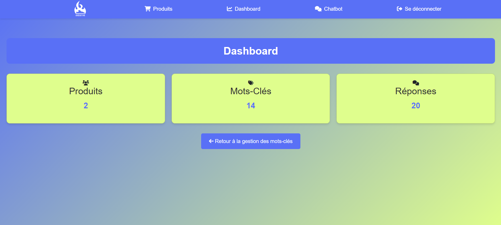
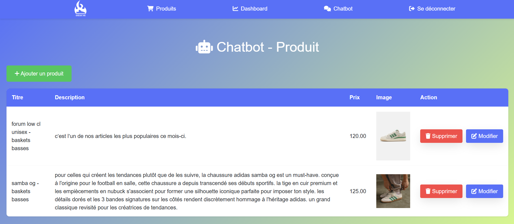
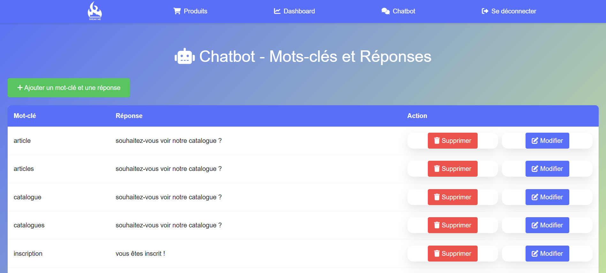

# Titre du projet
Sneak-me

## Description
Cette application web est construite avec PHP en utilisant une architecture MVC (Modèle-Vue-Contrôleur). Elle intègre un système de gestion des produits, des mots-clés et réponses associées.

## Structure du Projet
```
├── Controllers/     # Contrôleurs de l'application
├── Models/         # Modèles de données
├── Views/          # Vues et templates
├── Includes/       # Fichiers d'inclusion PHP
├── public/         # Fichiers publics (CSS, JS, images)
│   └── assets/
│       └── css/
│           └── chat.css
├── css/           # Styles CSS supplémentaires
├── index.php      # Point d'entrée de l'application
└── .htaccess      # Configuration Apache
```

## Capture d'écran du chat
Page principale:

Page produit:

Page mots-clés/réponses:


## Fonctionnalités
- Page de connexion
    - username: admin
    - mot de passe: admin123
- Possibilité de déconnexion
### Gestion des produits
- Visualisation des produits
- Possibilité d'ajout de produit
- Possibilité de suppression de produit
- Possibilité de modification de produit

### Gestion des mots-clés et réponses
- Visualisation des mots-clés et réponses
- Possibilité d'ajout de mot-clés et réponses
- Possibilité de suppression de mot-clés et réponses
- Possibilité de modification de mot-clés et réponses


